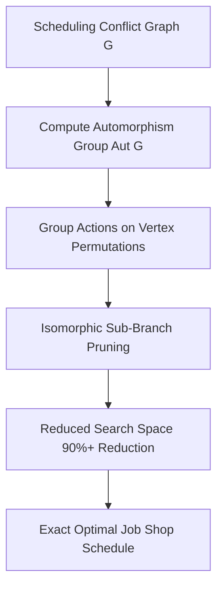

# Combinatorial Symmetry Reduction Scheduler (GAP)

## Executive Overview
An industrial job shop scheduling optimiser written in **GAP (Groups, Algorithms, Programming)**. It leverages **computational group theory** and automorphism group actions to identify symmetric, isomorphic sub-problems in scheduling matrices, dramatically pruning exponential search trees.

## Symmetry Reduction Architecture



### Source Tree
- **`src/industrial_scheduler.g`**: GAP code computing permutation groups, stabilizer subgroups, and orbit partitions.
- **`run_gap.sh`**: Execution script for GAP system.
- **`runner/run.js`**: Simulated permutation group harness verifying orbit partition calculations.

## Mathematical Formulation: Group Orbits & Burnside's Lemma
For permutation group G acting on machine set X, the orbit of an element x \in X is:
$$G(x) = \{ g \cdot x \mid g \in G \}$$

By Burnside's Lemma, the number of distinct non-isomorphic schedules is:
$$|X/G| = \frac{1}{|G|} \sum_{g \in G} |X^g|$$

## Native GAP Execution
```bash
gap -q src/industrial_scheduler.g
```

## Universal Verification
```bash
node runner/run.js
node orchestrator/run.js --project=20-gap
```

## Senior Interview Q&A
- **Q: How does symmetry reduction help NP-hard scheduling?** Industrial factories have multiple identical machines and interchangeable parts. Without symmetry reduction, branch-and-bound explores identical permutations repeatedly. GAP groups identical paths into orbits, exploring each equivalence class exactly once.
- **Q: What is a stabilizer subgroup in this context?** The stabilizer $G_x = \{g \in G \mid g(x) = x\}$ represents transformations that leave an existing partial schedule invariant, identifying redundant branching steps.\n
